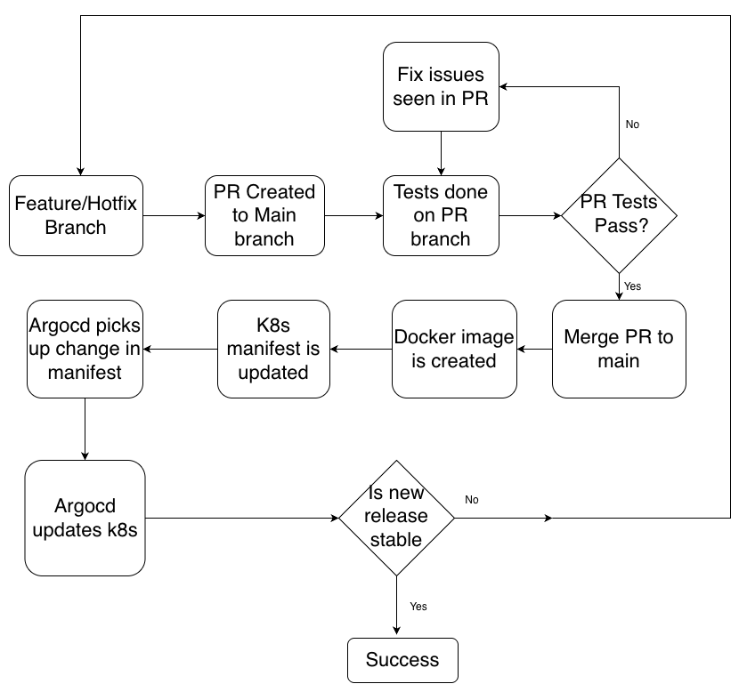

# FINCRA DEVOPS TAKE HOME TASK - SOLUTION PROVIDED BY VICTOR EFEDI

This solution shows the deployment of EKS infrastructure for a simple python application. This cloudnative solution deploys the application using manifests yaml file with and ingress managed by AWS ALB Controller.

## Application Development
The final idea is to always use GitOps which makes it easier to manage kubernetes resources. Tests have been added to the app as part of the CICD process. Application is managed in [app/hellofincra](app/hellofincra/) directory. This can be seen as a standalone repo in production scenarios.

## Kubernetes
In this solution, we are using only manifests files which has the commit of the application release as a docker tag which is deployed into the cluster. The resources have the following

* Resource request and limits have been set to manage resource used by the pods
* 3 replicas managed in a deployment for high availability
* Ingress to manage routing to the application using an AWS application LB managed with kubernetes

## Infrastructure Deployment
This has been documented [here](infra/README.md). Ideally, this is also a standalone repo managed by the DevOps Infra Team.
